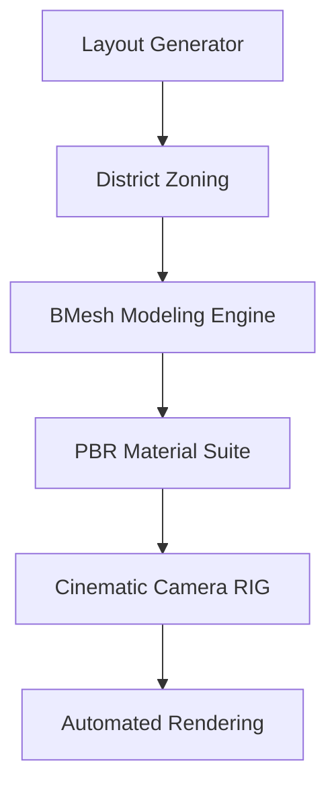

# 🏙️ Smart Procedural City Generator: Master Edition

A specialized, professional-grade procedural suite for Blender. Synthesize entire urban environments—from street-level detail to cinematic skylines—in one click.


---

## 📽️ The Master Vision

This project transforms Blender into a powerful urban simulation engine. It is designed for game developers, film studios, and architectural visualization experts who need high-fidelity cities with zero manual modeling.

### 🚀 Key Features (Master Synthesis)
- **📍 Multi-Style Layouts:** Instant generation of **Grid**, **Radial**, and **Organic** road networks.
- **🏗️ Advanced Skyscraper DNA:** Procedural buildings with **layered architecture**, step-backs, podiums, and rooftop equipment (antennas/helipads).
- **🗺️ GIS Mapping:** Integrated OpenStreetMap logic to fetch real-world coordinates and building footprints.
- **🎨 PBR Shader Suite:** Dynamic architecture-aware materials for **Cyberpunk**, **Modern**, and **Arabic** aesthetics.
- **🎬 Cinematic Studio:** Ready-to-render setup with **Nishita Sky** lighting and 400-frame orbital camera flythroughs.
- **⚡ Performance First:** Efficient batch-mesh processing and `bmesh` optimization for large-scale sprawl.

---

## 🛠️ Quick Start (Blender Only)

1. **Open Blender** (Version 4.0+ recommended).
2. Go to the **Scripting** tab.
3. Open [`CITY_GENERATOR_MASTER.py`](./CITY_GENERATOR_MASTER.py).
4. Click **Run Script**.
5. **Press SPACEBAR** in the 3D viewport to watch the cinematic orbital camera.

---

## 🎮 Pro Feature: GIS Integration

To generate a city based on a real-world location (e.g., "Casablanca"):
1. Run the GIS processor:
   ```bash
   python smart_city_generator/python_core/osm_lite.py "Casablanca"
   ```
2. Run [`MONOLITH_PHASE_4.py`](./smart_city_generator/MONOLITH_PHASE_4.py) inside Blender.

---

## 🏛️ Project Architecture



---

## 🌟 Contributions
Created  by **Imposter-zx**. 

Distributed under the MIT License.
