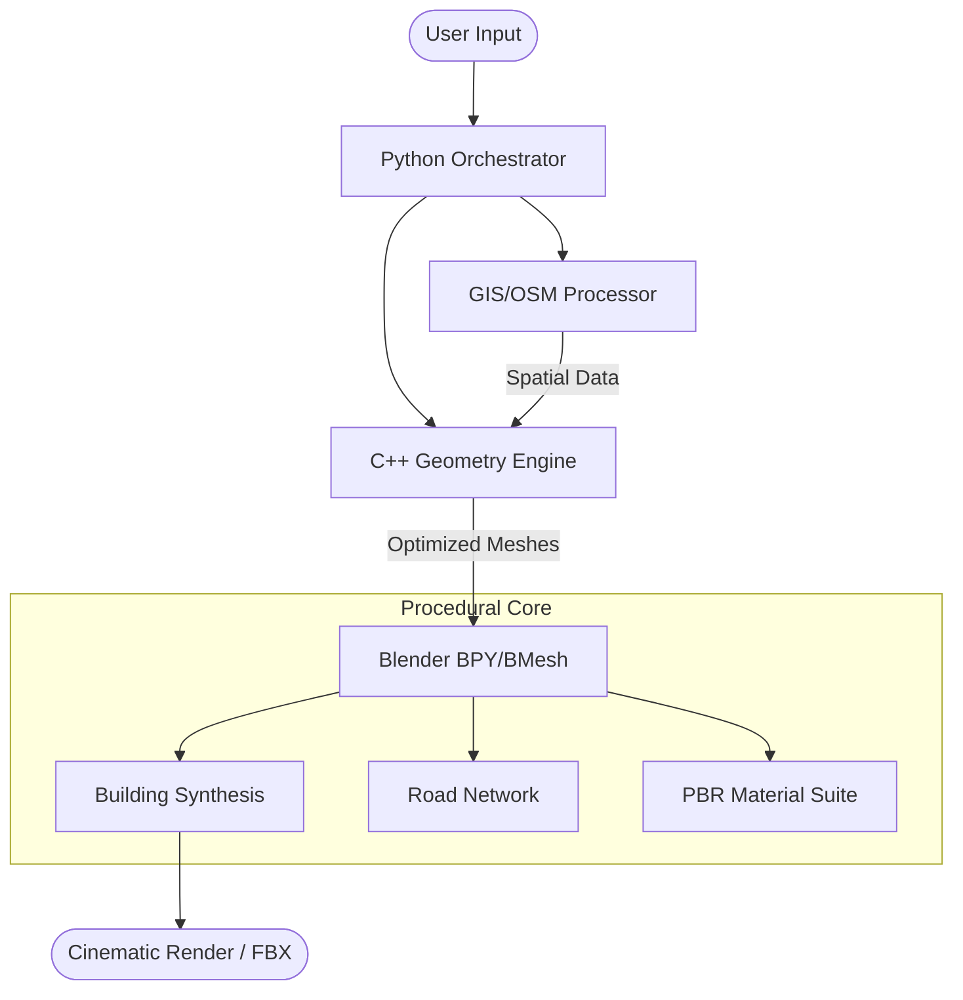

# 🏙️ Smart Procedural City Generator: Master Edition

[](https://github.com/Imposter-zx/SMART-PROCEDURAL-CITY-GENERATOR)
[](https://www.blender.org/)
[](https://www.python.org/)
[](https://isocpp.org/)
[](LICENSE)

A specialized, professional-grade procedural suite for Blender. Synthesize entire urban environments—from street-level detail to cinematic skylines—leveraging high-performance C++ geometry kernels and real-world GIS data.

---

## 📽️ The Master Vision

This project transforms Blender into a powerful urban simulation engine. It is designed for game developers, film studios, and architectural visualization experts who need high-fidelity cities with zero manual modeling. By combining **Python orchestration**, **C++ performance**, and **Blender's rendering power**, it delivers production-ready environments in seconds.

### 🚀 Key Features (Master Synthesis)

- **📍 Multi-Style Layouts:** Instant generation of **Grid**, **Radial**, and **Organic** road networks.
- **🏗️ Advanced Skyscraper DNA:** Procedural buildings with **layered architecture**, step-backs, podiums, and rooftop equipment (antennas/helipads).
- **🗺️ GIS Mapping:** Integrated OpenStreetMap (OSM) logic to fetch real-world coordinates and building footprints.
- **⚙️ C++ Geometry Engine:** High-speed lot subdivision and road graph optimization powered by a custom C++ core.
- **🎨 PBR Shader Suite:** Dynamic architecture-aware materials for **Cyberpunk**, **Modern**, and **Arabic** aesthetics.
- **🎬 Cinematic Studio:** Ready-to-render setup with **Nishita Sky** lighting and 400-frame orbital camera flythroughs.
- **⚡ Performance First:** Efficient batch-mesh processing and `bmesh` optimization for large-scale sprawl.

---

## 🛠️ Quick Start

### 🏁 Method A: The Blender "One-Click" Experience
Perfect for quick visualization and cinematic testing.

1. **Open Blender** (Version 4.2+ recommended).
2. Go to the **Scripting** tab.
3. Open [`CITY_GENERATOR_MASTER.py`](./CITY_GENERATOR_MASTER.py).
4. Click **Run Script**.
5. **Press SPACEBAR** in the 3D viewport to watch the cinematic orbital camera.

### 🌎 Method B: GIS & Real-World Synthesis
Generate a city based on real-world location data (e.g., "Casablanca").

1. **Install Dependencies:**
   ```bash
   pip install -r smart_city_generator/requirements.txt
   ```
2. **Fetch OSM Data:**
   ```bash
   python smart_city_generator/python_core/osm_lite.py "Casablanca"
   ```
3. **Generate in Blender:**
   Run [`MONOLITH_PHASE_4.py`](./smart_city_generator/MONOLITH_PHASE_4.py) inside Blender's scripting tab.

---

## 🏛️ Project Architecture

The system uses a hybrid architecture to balance ease of use with raw performance.



---

## 📂 Repository Structure

*   `CITY_GENERATOR_MASTER.py`: The all-in-one Blender script for instant generation.
*   `smart_city_generator/`: The full modular suite.
    *   `engine/`: C++ source for high-performance geometric calculations.
    *   `python_core/`: GIS processing and OSM integration logic.
    *   `blender_module/`: Advanced procedural modeling scripts.
    *   `docs/`: Detailed technical documentation.

---

## 🌟 Contributions & Credits

Created by **Imposter-zx** with support from **Antigravity AI**. 

Distributed under the **MIT License**. Build something amazing!

