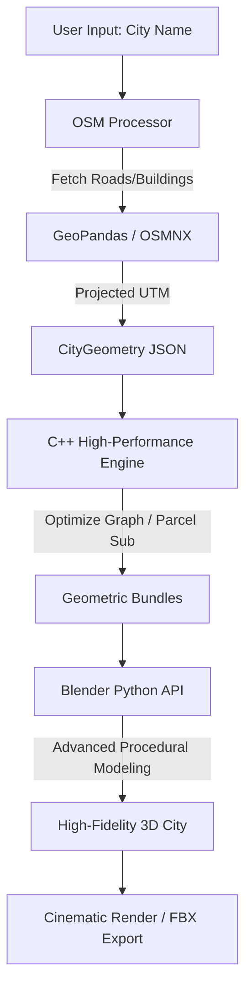

# Smart Procedural City Generator - Advanced GIS Architecture

## System Overview
The system now supports real-world data injection via OpenStreetMap (OSM), allowing it to synthesize 1:1 city layouts with high-fidelity procedural detail.



## Key Components

### 1. GIS Layer (Python)
- **Engine:** OSMNX + GeoPandas
- **Task:** Downloads vector data from OSM. Projects spherical coordinates (Lat/Lon) to planar meters (UTM).
- **Extraction:** Isolates building footprints, road hierarchy (Motorway vs Residential), and environmental zones (Parks/Water).

### 2. Algorithmic Layer (C++)
- **Optimization:** Simplifies dense GIS road graphs into clean geometric meshes.
- **Zoning:** Automates lot subdivision using recursive Voronoi or OBB (Oriented Bounding Box) splitting.

### 3. Rendering Layer (Blender)
- **Materials:** PBR shaders for glass, asphalt, and concrete.
- **Cinematic Studio:** Automated camera rigs for flythroughs and atmospheric lighting (Nishita Sky).
```
